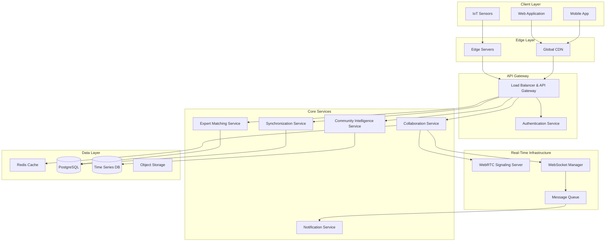

# Design Document: Real-Time Collaborative Agricultural Intelligence Network

## Overview

The Real-Time Collaborative Agricultural Intelligence Network transforms AgriResolve AI into a live, interconnected ecosystem where farmers, experts, and AI systems collaborate in real-time. This design leverages modern web technologies including WebRTC, WebSockets, and edge computing to create a scalable, responsive platform that maintains performance across diverse network conditions and device types.

The architecture follows a microservices approach with event-driven communication, enabling independent scaling of collaboration features while maintaining tight integration with existing AgriResolve AI capabilities. The system prioritizes offline-first design with intelligent synchronization to ensure accessibility in rural environments with intermittent connectivity.

## Architecture

### High-Level System Architecture



### Service Architecture Patterns

**Event-Driven Microservices**: Each service communicates through asynchronous events, enabling loose coupling and independent scaling. Critical for real-time features where multiple services need to react to user actions simultaneously.

**CQRS (Command Query Responsibility Segregation)**: Separate read and write models optimize for real-time queries while maintaining data consistency. Read models are optimized for collaboration views, while write models handle state changes.

**Edge Computing**: Geographically distributed edge servers reduce latency for real-time interactions and provide local caching for frequently accessed data.

## Components and Interfaces

### Collaboration Service

**Purpose**: Manages real-time collaboration sessions, participant coordination, and shared workspace state.

**Key Interfaces**:
```typescript
interface CollaborationSession {
  sessionId: string;
  participants: Participant[];
  sharedState: SharedWorkspace;
  permissions: SessionPermissions;
  createdAt: Date;
  expiresAt: Date;
}

interface SharedWorkspace {
  cropImages: ImageAnnotation[];
  diagnosticData: DiagnosticResult[];
  annotations: DrawingAnnotation[];
  chatMessages: Message[];
  expertRecommendations: Recommendation[];
}

interface Participant {
  userId: string;
  role: 'farmer' | 'expert' | 'observer';
  permissions: ParticipantPermissions;
  connectionStatus: 'connected' | 'disconnected' | 'reconnecting';
  lastActivity: Date;
}
```

**Real-Time State Management**: Uses operational transformation algorithms to handle concurrent edits to shared annotations and maintain consistency across all participants.

### Expert Matching Service

**Purpose**: Connects farmers with qualified experts based on expertise, availability, location, and language preferences.

**Key Interfaces**:
```typescript
interface ExpertProfile {
  expertId: string;
  specializations: Specialization[];
  certifications: Certification[];
  availability: AvailabilitySchedule;
  languages: Language[];
  geographicRegions: Region[];
  rating: ExpertRating;
}

interface MatchingRequest {
  farmerId: string;
  cropType: CropType;
  issueCategory: IssueCategory;
  urgency: 'low' | 'medium' | 'high' | 'emergency';
  preferredLanguages: Language[];
  location: GeoLocation;
  consultationType: 'text' | 'audio' | 'video';
}

interface ConsultationSession {
  sessionId: string;
  expert: ExpertProfile;
  farmer: FarmerProfile;
  startTime: Date;
  duration: number;
  recordingEnabled: boolean;
  sessionNotes: string;
  recommendations: Recommendation[];
}
```

**Intelligent Matching Algorithm**: Combines expertise relevance, geographic proximity, language compatibility, and current availability using weighted scoring to optimize expert-farmer matches.

### Community Intelligence Service

**Purpose**: Aggregates diagnostic data, tracks disease patterns, and generates predictive insights for outbreak prevention.

**Key Interfaces**:
```typescript
interface OutbreakPattern {
  diseaseType: DiseaseType;
  geographicCluster: GeoCluster;
  severity: SeverityLevel;
  trendDirection: 'increasing' | 'stable' | 'decreasing';
  predictedSpread: SpreadPrediction;
  recommendedActions: PreventiveAction[];
}

interface CommunityInsight {
  insightId: string;
  category: 'disease_trend' | 'treatment_effectiveness' | 'environmental_correlation';
  confidence: number;
  affectedRegions: Region[];
  timeframe: TimeRange;
  dataPoints: number;
  visualization: ChartConfiguration;
}

interface ValidationRequest {
  diagnosisId: string;
  aiConfidence: number;
  cropImage: ImageData;
  symptoms: Symptom[];
  environmentalContext: EnvironmentalData;
  requiredValidations: number;
}
```

**Machine Learning Pipeline**: Continuously processes incoming diagnostic data to identify patterns, update disease models, and generate predictive alerts using ensemble methods combining multiple AI models.

### Real-Time Communication Infrastructure

**WebRTC Integration**:
```typescript
interface WebRTCManager {
  createPeerConnection(sessionId: string, participantId: string): RTCPeerConnection;
  handleSignaling(signal: SignalingMessage): void;
  adaptQuality(networkConditions: NetworkQuality): void;
  enableScreenShare(participantId: string): MediaStream;
  recordSession(sessionId: string, options: RecordingOptions): void;
}

interface SignalingMessage {
  type: 'offer' | 'answer' | 'ice-candidate' | 'quality-update';
  sessionId: string;
  fromParticipant: string;
  toParticipant: string;
  payload: any;
  timestamp: Date;
}
```

**WebSocket Event System**:
```typescript
interface WebSocketEvent {
  eventType: 'state_change' | 'participant_join' | 'annotation_update' | 'chat_message';
  sessionId: string;
  participantId: string;
  payload: any;
  timestamp: Date;
  sequenceNumber: number;
}

interface EventProcessor {
  processEvent(event: WebSocketEvent): Promise<void>;
  broadcastToSession(sessionId: string, event: WebSocketEvent): void;
  handleReconnection(participantId: string, lastSequence: number): void;
}
```

### Synchronization Engine

**Purpose**: Manages offline-online data synchronization with conflict resolution and ensures data consistency across devices.

**Key Interfaces**:
```typescript
interface SyncOperation {
  operationId: string;
  entityType: string;
  entityId: string;
  operation: 'create' | 'update' | 'delete';
  data: any;
  timestamp: Date;
  deviceId: string;
  conflictResolution: ConflictStrategy;
}

interface ConflictResolver {
  resolveConflict(localOp: SyncOperation, remoteOp: SyncOperation): SyncOperation;
  mergeStrategies: {
    lastWriteWins: ConflictStrategy;
    userChoice: ConflictStrategy;
    automaticMerge: ConflictStrategy;
  };
}

interface OfflineStorage {
  queueOperation(operation: SyncOperation): void;
  getPendingOperations(): SyncOperation[];
  markSynced(operationId: string): void;
  getLocalState(entityId: string): any;
}
```

## Data Models

### Core Collaboration Entities

```typescript
// Session Management
interface CollaborationSession {
  id: string;
  title: string;
  description: string;
  createdBy: string;
  participants: SessionParticipant[];
  status: 'active' | 'paused' | 'completed' | 'archived';
  sharedWorkspace: WorkspaceState;
  permissions: SessionPermissions;
  metadata: SessionMetadata;
}

interface WorkspaceState {
  cropAnalysis: CropAnalysisData;
  annotations: AnnotationLayer[];
  chatHistory: ChatMessage[];
  expertRecommendations: ExpertRecommendation[];
  treatmentPlans: TreatmentPlan[];
  fieldData: FieldDataSnapshot[];
}

// Expert Network
interface ExpertProfile extends UserProfile {
  specializations: ExpertiseArea[];
  certifications: ProfessionalCertification[];
  consultationRates: ConsultationPricing;
  availability: AvailabilityCalendar;
  performanceMetrics: ExpertMetrics;
  verificationStatus: VerificationLevel;
}

interface ConsultationRecord {
  id: string;
  sessionId: string;
  expertId: string;
  farmerId: string;
  duration: number;
  consultationType: ConsultationType;
  recording: MediaFile;
  transcript: string;
  recommendations: Recommendation[];
  followUpScheduled: boolean;
  rating: ConsultationRating;
}

// Community Intelligence
interface DiseaseOutbreak {
  id: string;
  diseaseType: DiseaseClassification;
  geographicBounds: GeoBoundary;
  severity: OutbreakSeverity;
  firstReported: Date;
  lastUpdated: Date;
  affectedCrops: CropType[];
  reportedCases: OutbreakCase[];
  predictedSpread: SpreadModel;
  recommendedActions: ResponseAction[];
}

interface CommunityValidation {
  diagnosisId: string;
  validatorId: string;
  validationType: 'confirm' | 'reject' | 'modify';
  confidence: number;
  reasoning: string;
  alternativeDiagnosis?: DiagnosisAlternative;
  timestamp: Date;
  validatorCredentials: ValidatorCredentials;
}

// IoT and Field Monitoring
interface FieldSensor {
  sensorId: string;
  farmId: string;
  sensorType: SensorType;
  location: GeoCoordinate;
  installationDate: Date;
  calibrationData: CalibrationRecord;
  dataStreams: DataStream[];
  alertThresholds: AlertThreshold[];
  maintenanceSchedule: MaintenanceRecord[];
}

interface SensorReading {
  sensorId: string;
  timestamp: Date;
  measurements: SensorMeasurement[];
  quality: DataQuality;
  anomalyFlags: AnomalyFlag[];
  processed: boolean;
}
```

### Geospatial and Temporal Data

```typescript
interface GeoCluster {
  centroid: GeoCoordinate;
  radius: number;
  boundingBox: GeoBoundary;
  density: number;
  confidence: number;
}

interface TimeSeriesData {
  entityId: string;
  dataType: string;
  timeRange: TimeRange;
  resolution: TemporalResolution;
  dataPoints: TimeSeriesPoint[];
  aggregations: AggregationSummary;
}

interface SpreadPrediction {
  modelVersion: string;
  predictionDate: Date;
  timeHorizon: number;
  probabilityMap: ProbabilityGrid;
  confidenceInterval: ConfidenceRange;
  factorsConsidered: PredictionFactor[];
}
```

## Correctness Properties

*A property is a characteristic or behavior that should hold true across all valid executions of a system—essentially, a formal statement about what the system should do. Properties serve as the bridge between human-readable specifications and machine-verifiable correctness guarantees.*

Based on the prework analysis, I've identified numerous testable properties. After reviewing for redundancy, I'll consolidate related properties to avoid duplication while maintaining comprehensive coverage.

### Property Reflection

Many of the identified properties can be consolidated:
- Session management properties (1.1, 1.2, 1.3) can be combined into comprehensive session behavior properties
- WebRTC properties (1.5, 3.2) can be unified into communication establishment properties  
- Data synchronization properties (7.1, 7.2, 7.3) can be merged into offline-online sync properties
- Privacy properties (2.4, 6.4, 9.2, 9.4) can be consolidated into data anonymization properties
- Performance properties (1.3, 10.1) can be combined into latency requirements

### Core Correctness Properties

**Property 1: Session Uniqueness and State Consistency**
*For any* set of collaboration sessions created concurrently, all session identifiers should be unique, and all participants in each session should observe identical shared workspace state within 100ms of any state change.
**Validates: Requirements 1.1, 1.2, 1.3**

**Property 2: Expert Opinion Preservation**
*For any* collaboration session with multiple expert diagnoses, all expert viewpoints should be preserved with their confidence scores and reasoning, regardless of conflicts or consensus.
**Validates: Requirements 1.4**

**Property 3: WebRTC Communication Establishment**
*For any* consultation request with video enabled, WebRTC connections should be established with quality adaptation based on network conditions, and graceful degradation to audio-only or text when connectivity is poor.
**Validates: Requirements 1.5, 3.2, 3.5**

**Property 4: Real-Time Geospatial Updates**
*For any* disease case report, the outbreak map should update geospatial visualizations in real-time, and when outbreak patterns exceed threshold densities, automated alerts should be generated to relevant stakeholders.
**Validates: Requirements 2.1, 2.2**

**Property 5: Dashboard Content Completeness**
*For any* community intelligence dashboard access, the display should include aggregated trends, hotspots, and predictive models based on available data.
**Validates: Requirements 2.3**

**Property 6: Data Anonymization Consistency**
*For any* diagnostic data aggregation, treatment tracking, or location sharing, all personally identifiable information should be anonymized while preserving analytical value and complying with privacy regulations.
**Validates: Requirements 2.4, 6.4, 9.2, 9.4**

**Property 7: Geographic Recommendation Accuracy**
*For any* detected conditions, the system should suggest treatments and outcomes from geographically and contextually similar cases based on community success rates.
**Validates: Requirements 2.5, 6.3**

**Property 8: Expert Matching Algorithm Correctness**
*For any* farmer consultation request, the system should match available specialists based on expertise relevance, geographic proximity, and language compatibility using weighted scoring.
**Validates: Requirements 3.1**

**Property 9: Consultation Tool Availability**
*For any* active consultation session, real-time annotation and markup tools should be accessible to experts, and session recordings with recommendations should be automatically saved upon completion.
**Validates: Requirements 3.3, 3.4**

**Property 10: Validation Workflow Integrity**
*For any* AI diagnosis, validation requests should be presented to qualified community members, votes should be weighted by expertise and accuracy, and consensus should update AI confidence scores and learning models.
**Validates: Requirements 4.1, 4.2, 4.3**

**Property 11: Validation Conflict Resolution**
*For any* conflicting validations, cases should be flagged for expert review, and users with consistently accurate validations should receive increased validation weight.
**Validates: Requirements 4.4, 4.5**

**Property 12: IoT Connection Security**
*For any* field monitor device connection, secure WebSocket connections should be established for continuous data streaming with proper authentication and encryption.
**Validates: Requirements 5.1**

**Property 13: Anomaly Detection and Response**
*For any* sensor data indicating anomalies or significant environmental changes, automated alerts should be triggered, collaborative analysis sessions should be suggested, and diagnostic models should be updated in real-time.
**Validates: Requirements 5.2, 5.3**

**Property 14: Sensor Data Reliability**
*For any* offline sensors, data should be queued for synchronization when connectivity resumes, and conflicting sensor readings should trigger data validation algorithms with inconsistency flagging.
**Validates: Requirements 5.4, 5.5**

**Property 15: Treatment Data Completeness**
*For any* applied treatment, all details including timing and expected outcomes should be recorded, and treatment results should capture outcome data with photos, measurements, and effectiveness ratings.
**Validates: Requirements 6.1, 6.2**

**Property 16: Treatment Algorithm Updates**
*For any* emerging treatment effectiveness patterns, recommendation algorithms should be updated and insights should be shared with the community while maintaining privacy.
**Validates: Requirements 6.5**

**Property 17: Offline-Online Synchronization**
*For any* network connectivity loss, offline mode should be enabled with local caching, and upon reconnection, offline changes should synchronize with conflict resolution algorithms and queued actions should execute.
**Validates: Requirements 7.1, 7.2, 7.3**

**Property 18: Sync Progress and Conflict Resolution**
*For any* large dataset synchronization, critical updates should be prioritized with progress indicators, and sync conflicts should present resolution options with clear explanations.
**Validates: Requirements 7.4, 7.5**

**Property 19: Cross-Device Responsive Functionality**
*For any* device type or screen size, collaborative features should provide touch-optimized interfaces with gesture support while maintaining full functionality and session continuity when switching between devices.
**Validates: Requirements 8.1, 8.2, 8.5**

**Property 20: Bandwidth Optimization**
*For any* limited network bandwidth scenario, data usage should be optimized while preserving real-time collaboration capabilities and seamless device integration for field data collection.
**Validates: Requirements 8.3, 8.4**

**Property 21: Security Implementation**
*For any* collaboration session, end-to-end encryption should be implemented for all communications, expert credentials should be verified with certification records maintained, and suspicious activities should trigger automated security measures.
**Validates: Requirements 9.1, 9.3, 9.5**

**Property 22: Performance Under Load**
*For any* concurrent user load increase, response times should remain sub-200ms for real-time interactions, and during peak usage periods, 99.9% uptime should be maintained with graceful degradation.
**Validates: Requirements 10.1, 10.4**

**Property 23: Scalability and Load Management**
*For any* geographic distribution across multiple regions, edge computing should reduce latency, data volume growth should trigger automatic resource scaling, and resource limits should activate intelligent load balancing with priority queuing.
**Validates: Requirements 10.2, 10.3, 10.5**

<function_calls>
<invoke name="prework">
<parameter name="featureName">real-time-collaborative-network

## Error Handling

### Network Resilience

**Connection Failure Recovery**: Implement exponential backoff with jitter for WebSocket reconnections. Maximum retry attempts: 10 with base delay of 1 second, maximum delay of 30 seconds.

**WebRTC Fallback Strategy**: 
1. Primary: Direct peer-to-peer connection
2. Fallback 1: STUN server-mediated connection  
3. Fallback 2: TURN server relay
4. Final fallback: Graceful degradation to text-based communication

**Offline Mode Handling**: 
- Detect network loss within 5 seconds using heartbeat mechanism
- Cache critical data locally using IndexedDB with 100MB storage limit
- Queue operations with priority levels (critical, normal, low)
- Implement conflict resolution using vector clocks for concurrent edits

### Data Integrity Protection

**Validation Failures**: 
- Malformed sensor data: Log error, request retransmission, use last known good value
- Invalid user input: Provide immediate feedback with specific error messages
- Corrupted file uploads: Implement chunked upload with MD5 verification

**Synchronization Conflicts**:
- Operational Transform for concurrent text edits
- Last-write-wins for simple field updates with user notification
- Manual resolution UI for complex conflicts with side-by-side comparison

**Security Violations**:
- Rate limiting: 100 requests per minute per user, 1000 per minute per IP
- Authentication failures: Lock account after 5 attempts, require email verification
- Suspicious activity: Automatic session termination, administrator notification

### Service Degradation Strategies

**High Load Conditions**:
- Implement circuit breaker pattern with 50% failure threshold
- Reduce real-time update frequency from 100ms to 500ms
- Disable non-essential features (video recording, advanced analytics)
- Queue non-critical operations for later processing

**Partial Service Failures**:
- Expert matching service down: Show cached expert list with availability warnings
- Community intelligence unavailable: Display local diagnostic history
- IoT service offline: Continue with manual data entry options

## Testing Strategy

### Dual Testing Approach

The testing strategy combines unit testing for specific scenarios with property-based testing for comprehensive coverage across all possible inputs and conditions.

**Unit Testing Focus**:
- Specific integration points between microservices
- Edge cases for network failure scenarios
- Error condition handling and recovery mechanisms
- User interface interactions and responsive design breakpoints
- Security boundary validation and authentication flows

**Property-Based Testing Focus**:
- Universal properties that must hold across all valid system states
- Data consistency across concurrent operations
- Performance characteristics under varying load conditions
- Correctness of algorithms (matching, recommendation, synchronization)
- Comprehensive input validation across all data types

### Property-Based Testing Configuration

**Testing Framework**: Use Hypothesis for Python services, fast-check for TypeScript/JavaScript components, and QuickCheck for any Haskell components.

**Test Configuration**:
- Minimum 100 iterations per property test to ensure statistical significance
- Shrinking enabled to find minimal failing examples
- Custom generators for domain-specific data types (crop diseases, sensor readings, geographic coordinates)
- Stateful testing for session management and synchronization workflows

**Property Test Tagging**: Each property-based test must include a comment referencing its corresponding design document property:
```python
# Feature: real-time-collaborative-network, Property 1: Session Uniqueness and State Consistency
def test_session_uniqueness_and_consistency():
    # Test implementation
```

**Coverage Requirements**:
- All 23 correctness properties must have corresponding property-based tests
- Unit test coverage minimum 80% for critical paths
- Integration test coverage for all service-to-service communication
- End-to-end test coverage for complete user workflows

### Performance Testing

**Load Testing Scenarios**:
- 1,000 concurrent collaboration sessions
- 10,000 simultaneous IoT sensor connections  
- 100,000 community validation requests per hour
- Geographic distribution across 5 continents

**Latency Requirements**:
- Real-time updates: < 100ms within same region, < 200ms cross-region
- Expert matching: < 2 seconds for initial results
- Outbreak map updates: < 500ms for new data points
- Synchronization after reconnection: < 5 seconds for typical datasets

### Security Testing

**Penetration Testing Focus**:
- WebRTC signaling server security
- WebSocket connection hijacking attempts
- Data anonymization effectiveness
- Expert credential verification bypass attempts

**Compliance Validation**:
- GDPR compliance for European users
- Agricultural data privacy regulations (varies by region)
- Professional certification verification standards
- End-to-end encryption implementation correctness